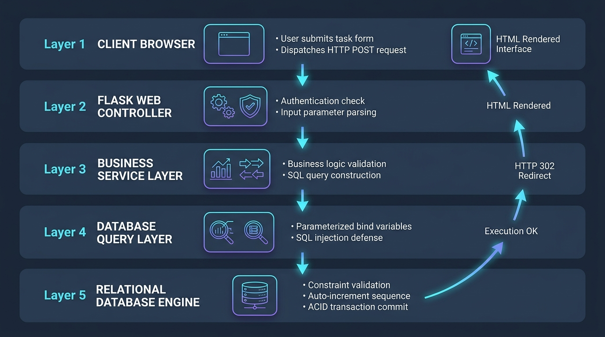
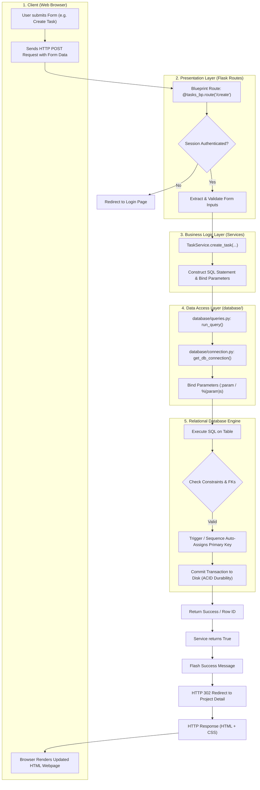
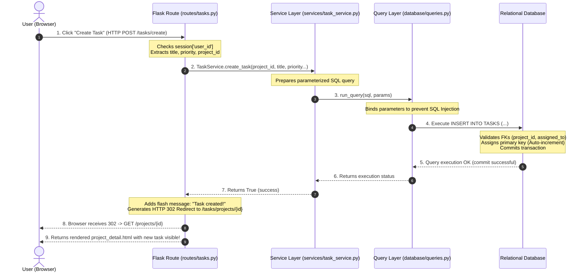

# Project-Helix — End-to-End Request-Response Architecture Flowchart

This document details the exact end-to-end lifecycle of a web request in **Project-Helix**—from the moment a user clicks an action in the browser, down to the database execution, and back up to the rendered user interface.

---

## 1. High-Level System Flowchart

---

## 2. Sequence Diagram (Step-by-Step Timeline)

---

## 3. Real-World Walkthrough (Example: "Creating a Task")

| Step | Component | What Happens Under the Hood |
|---|---|---|
| **1. User Action** | **Browser (Client)** | User fills the form on `task_create.html` (e.g. Title: *"Build Connection Pool"*, Project ID: `1`, Priority: `'High'`) and clicks the **Create Task** button. |
| **2. HTTP Transmission** | **Network** | The browser sends an `HTTP POST` request to `http://localhost:5000/tasks/create` with the form payload in the request body. |
| **3. Controller Handling** | **Flask Route (`routes/tasks.py`)** | The `@tasks_bp.route('/create', methods=['POST'])` function intercepts the request:  • Checks `session['user_id']` (redirects to login if unauthenticated).  • Extracts `request.form.get('title')`, `project_id`, `priority`. |
| **4. Service Execution** | **Service Layer (`services/task_service.py`)** | Calls `TaskService.create_task(...)`. The service prepares an `INSERT INTO TASKS` statement with clean bind parameters: `{"project_id": 1, "title": "Build Connection Pool", "priority": "high"}`. |
| **5. Parameter Binding** | **Database Layer (`database/queries.py`)** | The `run_query()` function opens a connection using `get_db_connection()` and sends the SQL and bind dictionary separately. **SQL Injection is prevented** because user input is never concatenated into raw SQL strings. |
| **6. Database Engine** | **Database (RDBMS)** | The database server executes the command:  • **Integrity Check:** Confirms `project_id = 1` exists in table `PROJECTS`.  • **Domain Check:** Verifies `priority IN ('low', 'medium', 'high')`.  • **Primary Key Generation:** Assigns the next unique ID from the sequence (e.g. `task_id = 11`).  • **Commit:** Writes data changes permanently to disk according to ACID properties. |
| **7. Return Flow** | **Python & Flask** | The database returns confirmation $\rightarrow$ `run_query()` returns $\rightarrow$ `TaskService` returns `True` $\rightarrow$ Flask adds a notification: `flash('Task created!', 'success')`. |
| **8. UI Update** | **Browser (Client)** | Flask sends an `HTTP 302 Redirect` to `project_detail`. The browser automatically requests the updated page, and Jinja2 renders the table showing the new task with its assigned ID and status badge. |

---

## 4. How to Explain This in Viva (10-Second Summary)

> *"Sir, Project-Helix follows an industry-standard **Layered MVC Architecture**:*  
> *When a user interacts with the HTML frontend, the browser dispatches an HTTP request to our **Flask Route Controllers**. The Controller verifies user authentication and delegates the request to the **Service Layer** for business validation.*  
> *The Service layer invokes our **Database Query Layer**, which binds inputs safely to prevent SQL injection and executes the query against our relational database.*  
> *The database engine enforces foreign key constraints and triggers, permanently commits the transaction, and returns the result back through the pipeline so Jinja2 can render the updated web page for the user."*
