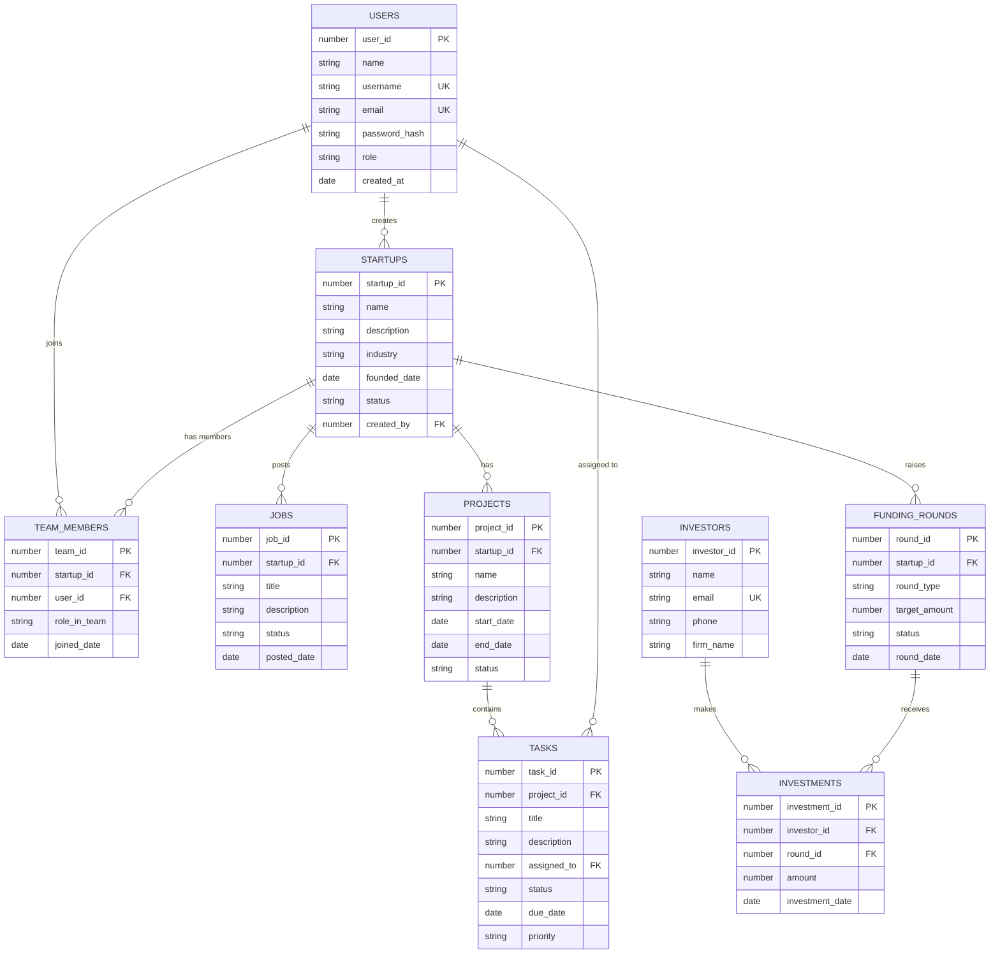

# Entity-Relationship (ER) Diagram Specification
## Project Helix — 9-Table 3NF Database Architecture
**Academic Source:** Aditya University — Project_Helix_DBMS_25B11CS893.pptx  
**Total Entities:** 9 (7 Strong Entities, 2 Associative Entities)  
**Total Attributes:** 52  

---

## 1. Schema Diagram (as presented in PPT Slide 32)

---

## 2. Table Classification (Slide 8 & 21)

### Strong Entities (7 Tables)
Entities that have their own Primary Key and can exist independently:
1. **`USERS`**: `user_id` (PK) — 7 Attributes
2. **`STARTUPS`**: `startup_id` (PK) — 7 Attributes
3. **`JOBS`**: `job_id` (PK) — 6 Attributes
4. **`PROJECTS`**: `project_id` (PK) — 6 Attributes
5. **`TASKS`**: `task_id` (PK) — 7 Attributes
6. **`FUNDING_ROUNDS`**: `round_id` (PK) — 6 Attributes
7. **`INVESTORS`**: `investor_id` (PK) — 4 Attributes

### Associative Entities (2 Tables)
Entities used to represent many-to-many relationships between other entities and carry relationship attributes:
1. **`TEAM_MEMBERS`**: `team_id` (PK) — 5 Attributes
   - Connects: `USERS` ↔ `STARTUPS`
   - Foreign Keys: `startup_id`, `user_id`
   - Relationship Attributes: `role_in_team`, `joined_date`
2. **`INVESTMENTS`**: `investment_id` (PK) — 4 Attributes
   - Connects: `INVESTORS` ↔ `FUNDING_ROUNDS`
   - Foreign Keys: `investor_id`, `round_id`
   - Relationship Attributes: `amount`, `investment_date`

---

## 3. Relationships & Participation Constraints (Slides 10–19)

| # | Relationship | Side A Participation | Side B Participation | Explanation |
|---|---|---|---|---|
| **1** | `USERS —CREATES— STARTUPS` | USERS: **Partial** | STARTUPS: **Total** | Not every user creates a startup; every startup must have a creator. |
| **2** | `USERS —JOINS— TEAM_MEMBERS` | USERS: **Partial** | TEAM_MEMBERS: **Total** | A user may never join a team; every membership row requires a user. |
| **3** | `STARTUPS —HAS MEMBERS— TEAM_MEMBERS` | STARTUPS: **Partial** | TEAM_MEMBERS: **Total** | Startups can exist before team members join; every membership row needs a startup. |
| **4** | `STARTUPS —POSTS— JOBS` | STARTUPS: **Partial** | JOBS: **Total** | Posting jobs is optional; every job belongs to a startup. |
| **5** | `STARTUPS —HAS— PROJECTS` | STARTUPS: **Partial** | PROJECTS: **Total** | A startup may have zero projects; every project must belong to a startup. |
| **6** | `PROJECTS —CONTAINS— TASKS` | PROJECTS: **Partial** | TASKS: **Total** | A project may have zero tasks initially; every task belongs to a project. |
| **7** | `USERS —ASSIGNED TO— TASKS` | USERS: **Partial** | TASKS: **Partial** | Not every user is assigned tasks; a task may remain unassigned (`NULL` FK). |
| **8** | `STARTUPS —HAS/RAISES— FUNDING_ROUNDS` | STARTUPS: **Partial** | FUNDING_ROUNDS: **Total** | Not every startup raises funds; every round belongs to a startup. |
| **9** | `INVESTORS —MAKES— INVESTMENTS` | INVESTORS: **Partial** | INVESTMENTS: **Total** | An investor profile may exist prior to investing; every investment requires an investor. |
| **10** | `FUNDING_ROUNDS —RECEIVES— INVESTMENTS` | FUNDING_ROUNDS: **Partial** | INVESTMENTS: **Total** | A funding round may be unfunded initially; every investment belongs to a round. |

---

## 4. ER-to-Relational Mapping (Slide 20)

- `STARTUPS.created_by` → `USERS.user_id`
- `TEAM_MEMBERS.user_id` → `USERS.user_id`
- `TEAM_MEMBERS.startup_id` → `STARTUPS.startup_id`
- `JOBS.startup_id` → `STARTUPS.startup_id`
- `PROJECTS.startup_id` → `STARTUPS.startup_id`
- `TASKS.project_id` → `PROJECTS.project_id`
- `TASKS.assigned_to` → `USERS.user_id`
- `FUNDING_ROUNDS.startup_id` → `STARTUPS.startup_id`
- `INVESTMENTS.investor_id` → `INVESTORS.investor_id`
- `INVESTMENTS.round_id` → `FUNDING_ROUNDS.round_id`
